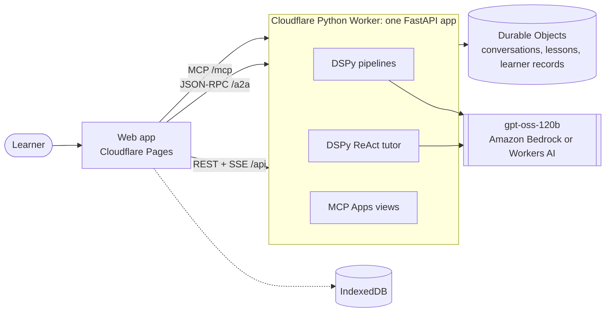
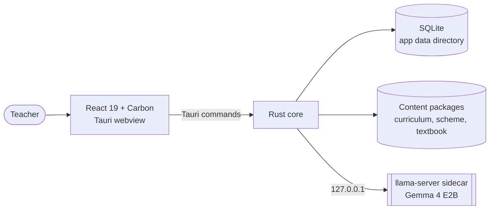

# Architecture

## Two kinds of model work

- **Pipelines** write something on request: the subjects for a class, a subject's topics, a path to a goal, a lesson. Their steps are fixed and their output shape is declared, so a malformed answer is a validation error, not a broken page.
- **The tutor** is a DSPy ReAct agent that talks to the learner. At each step it calls a tool or answers. Its tools do what writing cannot: calculate, open or change the learner's plan, and set practice or a passage as a card the learner taps.

Both use one model, built in one place, for every language. Yoruba, Hausa, Igbo and Nigerian Pidgin lessons are written in English and translated stage by stage, because the model writes better English.

A lesson is staged: a plan, then each slide with the earlier slides as context, then a practice question. A failed slide costs one slide, not the lesson.

## Three surfaces, one app

| Path | Protocol | Carries |
|---|---|---|
| `/api` | REST and server-sent events | Session tokens, subjects and curriculum streams, the learner's record, the school catalogue |
| `/a2a` | [A2A](https://a2a-protocol.org) JSON-RPC | The tutor. Its card is at `/.well-known/agent-card.json` on the origin root ([RFC 8615](https://www.rfc-editor.org/rfc/rfc8615)) |
| `/mcp` | [MCP Apps](https://github.com/modelcontextprotocol/ext-apps) | The lesson, practice and passage views, and the tools they call |

The views are the server's own UI (`apps/server/ui`). The web app is only their host: it frames each view in a sandbox page on the server's origin (`/ui-sandbox`) and passes messages. A view's answers go to the server, which keeps them on the learner's record. The tutor then reads them with the learner's next message.

## State

- **Signing in is optional.** The app names its device with a random id and gets a signed session token for it. A Google account (Firebase), a parent's or an older learner's own, holds up to eight learners, and a device learns as one of them at a time. Each learner has their own record and plan, which all their devices share; the first time a device chooses a learner, its own record joins them. The server keeps one record per learner: the topics with a lesson or finished, every answer, and the tutor conversations. Removing a learner, or the account, forgets all of it, and signing out leaves nothing on the device.
- **Durable Objects** keep each tutor conversation (older exchanges folded into a summary), each lesson, and each learner record. A lesson is made in a Durable Object's alarm, not in a request, so it carries on while the learner is elsewhere.
- **Voice lessons**, which the Android app teaches aloud, keep each learner's recordings in R2 and their offered steps, heard steps and marked turns in D1, all under the learner's key. The tutor Worker (`apps/tutor`, TypeScript, reached only through a service binding) marks each spoken answer and keeps a Durable Object per learner with their spaced-repetition memory. Removing a learner forgets all three.
- **The browser** keeps the plan, conversations and copies of lessons in IndexedDB, and a service worker keeps the app, so both open offline. What a view does offline waits in an outbox until the connection is back.
- **The school catalogue** (`apps/server/src/app/education/data/systems`) has one file per school system. It lists every class from the first year of primary to the last of secondary, as learners there name them (JSS 1, Year 9, Grade 9 in Junior School), with the age a learner starts it. Each file cites the official sources it was checked against and says how far it can be trusted:
  - `sourced`: confirmed by the sources it cites;
  - `draft`: some of it could not be confirmed, and its notes say what;
  - `reviewed`: also read by someone who knows those schools.

  A country without a file, such as Antarctica, gets Grade 1 to 12 from age 6.

## Workers runtime rules

The Worker runs CPython on Pyodide. The same app runs under uvicorn locally, with memory in place of Durable Objects and no rate limits.

- **No threads**, so every handler and dependency is `async`, and every model call is awaited.
- **Startup is a snapshot.** Top-level imports run at deploy and are snapshotted. Nothing may draw randomness at import, so the DSPy modules are built on first use. The snapshot has an unpublished size cap, so unused packages are stubbed or excluded, and the A2A SDK loads inside the first request.
- **No LiteLLM.** DSPy calls the model through its own engine, lm15, over an httpx transport. Both hosts answer OpenAI Chat Completions: Bedrock on its `bedrock-mantle` endpoint (`bedrock-runtime` mixes gpt-oss's reasoning into the answer), Workers AI on the account's `/ai/v1` endpoint. `LLM_HOST` chooses.
- **No `dspy.configure`.** DSPy lets only the task that first called it call it again, so the app sets the model for each request.

## graspy-teacher

`apps/teacher` (graspy-teacher) is the app for teachers and schools. It shares no code or data with the web app or the server, and it works without a connection.

- **The network is for the model files only.** The model, and the projector that lets it read a photograph of a lesson plan, are downloaded once from a pinned Hugging Face revision or copied from a drive. Each file is checked by byte size and SHA-256 before install, and an interrupted download resumes. Everything else runs on the teacher's computer.
- **The model runs in a sidecar.** `llama-server` (llama.cpp, a static Metal build) listens on a loopback port. A small supervisor, `graspy-inference-runner`, stops it when the app exits. Only a model that passed the [qualification](../apps/teacher/docs/content/ordering-fractions-gemma-qualification.md) for the shipped program is offered.
- **A lesson is a program of stages.** `lesson-plan.granular` writes objectives, knowledge, assessments and steps as separate model calls. Each call has a JSON Schema that constrains decoding and a validator in Rust. Deterministic stages assemble the result. Runs are saved stage by stage, so a closed app resumes where it stopped.
- **Content ships with the app.** The NERDC JSS 1 Mathematics curriculum, the Lagos scheme of work and a Siyavula textbook corpus are packages in `src-tauri/resources/content`. Lessons cite the passages they were written from. Licences: [THIRD_PARTY_CONTENT.md](../apps/teacher/THIRD_PARTY_CONTENT.md).
- **State is SQLite.** Migrations are in `src-tauri/src/db/migrations`. Approved materials are append-only: an edit makes a new version.
- **The two halves agree by test.** The Rust suite writes every command's answer type to `contracts/command-answers.json`, and a frontend test checks its types against that file.
- **Export is native.** PDF and print use WebKit and AppKit, with KaTeX and the fonts embedded, so exported documents need no network.

Design notes for each feature: `apps/teacher/docs/architecture/`.
