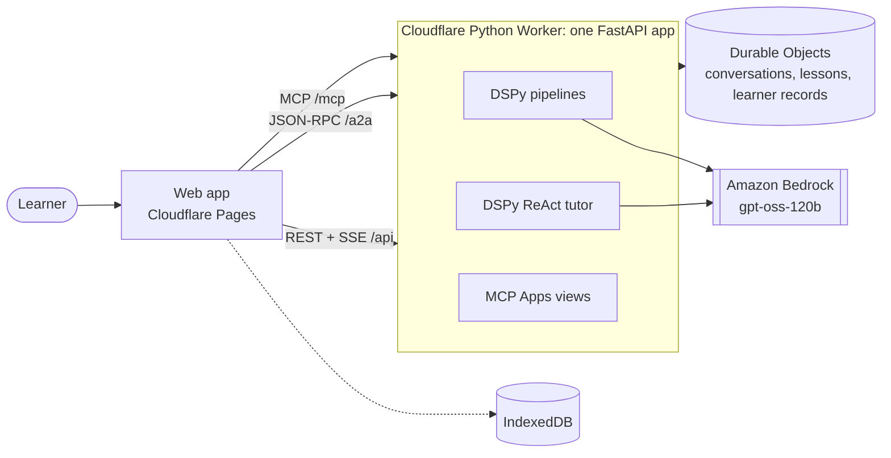

# Architecture

## Two kinds of model work

- **Pipelines** write something on request: the subjects for a class, a subject's topics, a path to a goal, a lesson. Their steps are fixed and their output shape is declared, so a malformed answer is a validation error, not a broken page.
- **The tutor** is a DSPy ReAct agent that talks to the learner. At each step it calls a tool or answers. Its tools do what writing cannot: calculate, open or change the learner's plan, and set practice or a passage as a card the learner taps.

Both use one model, built in one place, for every language. Yoruba, Hausa and Igbo lessons are written in English and translated stage by stage, because the model writes better English.

A lesson is staged: a plan, then each slide with the earlier slides as context, then a practice question. A failed slide costs one slide, not the lesson.

## Three surfaces, one app

| Path | Protocol | Carries |
|---|---|---|
| `/api` | REST and server-sent events | Session tokens, subjects and curriculum streams, the learner's record, the school catalogue |
| `/a2a` | [A2A](https://a2a-protocol.org) JSON-RPC | The tutor. Its card is at `/.well-known/agent-card.json` on the origin root ([RFC 8615](https://www.rfc-editor.org/rfc/rfc8615)) |
| `/mcp` | [MCP Apps](https://github.com/modelcontextprotocol/ext-apps) | The lesson, practice and passage views, and the tools they call |

The views are the server's own UI (`apps/server/ui`). The web app is only their host: it frames each view in a sandbox page on the server's origin (`/ui-sandbox`) and passes messages. A view's answers go to the server, which keeps them on the learner's record. The tutor then reads them with the learner's next message.

## State

- **Nobody signs in.** The app names its device with a random id and gets a signed session token for it. The server keeps one record per device: the topics with a lesson or finished, and every answer.
- **Durable Objects** keep each tutor conversation (older exchanges folded into a summary), each lesson, and each learner record. A lesson is made in a Durable Object's alarm, not in a request, so it carries on while the learner is elsewhere.
- **The browser** keeps the plan, conversations and copies of lessons in IndexedDB, and a service worker keeps the app, so both open offline. What a view does offline waits in an outbox until the connection is back.
- **The school catalogue** (`apps/server/src/app/education/data/systems`) has one file per school system. It lists every class from the first year of primary to the last of secondary, as learners there name them (JSS 1, Year 9, Grade 9 in Junior School), with the age a learner starts it. Each file cites the official sources it was checked against and says how far it can be trusted:
  - `sourced`: confirmed by the sources it cites;
  - `draft`: some of it could not be confirmed, and its notes say what;
  - `reviewed`: also read by someone who knows those schools.

  A country without a file, such as Antarctica, gets Grade 1 to 12 from age 6.

## Workers runtime rules

The Worker runs CPython on Pyodide. The same app runs under uvicorn locally, with memory in place of Durable Objects and no rate limits.

- **No threads**, so every handler and dependency is `async`, and every model call is awaited.
- **Startup is a snapshot.** Top-level imports run at deploy and are snapshotted. Nothing may draw randomness at import, so the DSPy modules are built on first use. The snapshot has an unpublished size cap, so unused packages are stubbed or excluded, and the A2A SDK loads inside the first request.
- **No LiteLLM.** DSPy calls Bedrock through its own engine, lm15, over an httpx transport. It uses Bedrock's `bedrock-mantle` Chat Completions endpoint; `bedrock-runtime` mixes gpt-oss's reasoning into the answer.
- **No `dspy.configure`.** DSPy lets only the task that first called it call it again, so the app sets the model for each request.
